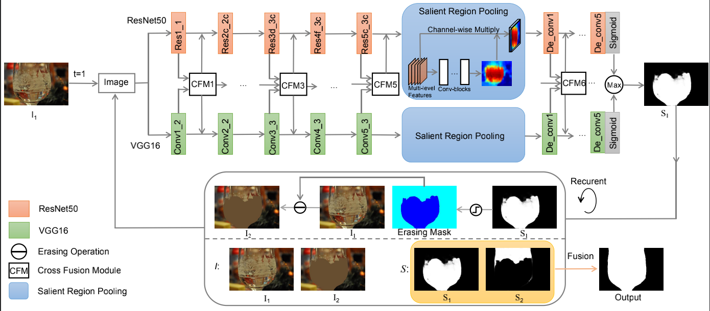
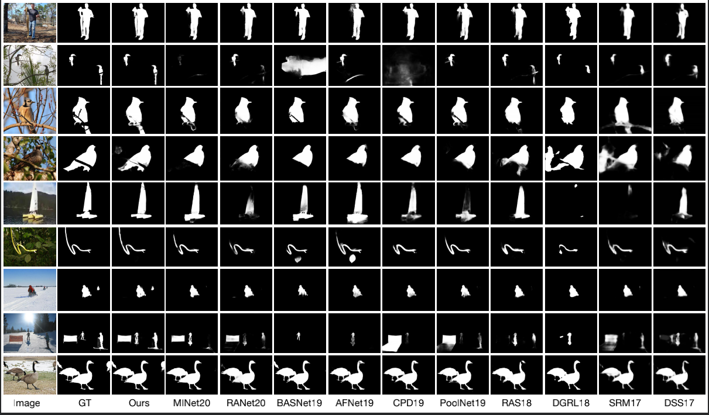
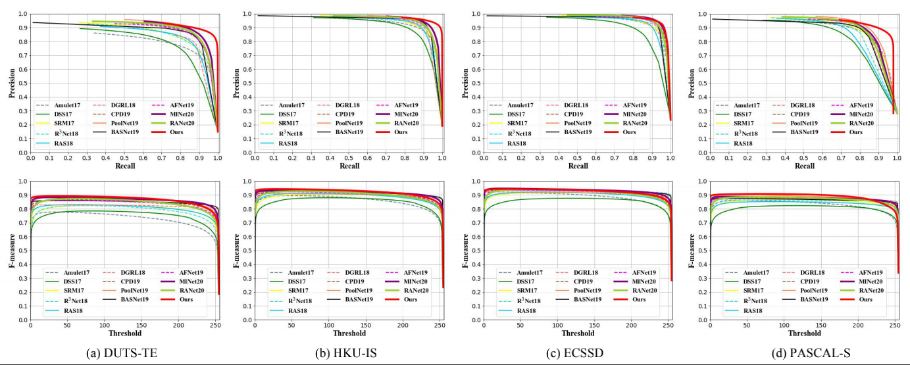
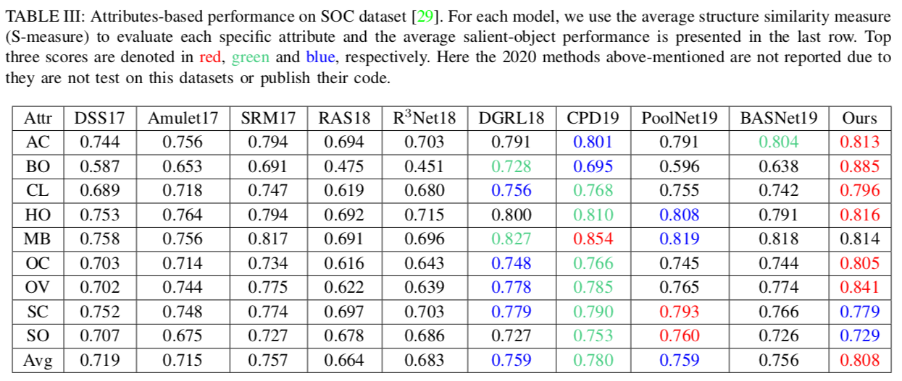

# Easy Regions First: Self-paced Learning for Integrate Salient Object Detection

## code coming soon!

## Abstract

Accurately segment the integral salient object is very challenging due to the heterogeneous of salient regions in terms of their illumination, texture, and contrast. In this paper,  we propose a simple yet effective framework to address this problem. On the one hand, we propose a novel two-stream structure to discover the complementary object regions by using two independent  supervisor and obtain relatively complete salient regions. On the other hand, instead of segmenting entire salient regions at one time, we introduce self-paced adversarial learning algorithm for localizing and mining salient regions progressively. By adapting the weight of the salient regions, our self-paced adversarial learning  algorithm can train multiple complementary saliency networks sequentially, where each of them focuses on mining new salient regions ignored by previous stage in an easy-to-hard way. With such a self-paced learning, we can finally produce integral salient regions. Extensive experiments on five datasets show that the proposed model outperforms 14 state-of-the-art methods. In addition, the attribute-based performance on the SOC dataset also demonstrate the superiority of our approach.

## Network architecture

##Requirements
- Python 3.5
-  OpenCV
- PyTorch 0.4

### Visual comparison with previous start-of-the-arts

### PR and F-measure curves

## Attributes-based performance on SOC

## Saliency maps

We provide the results online datasets including  [DUT-OMRON](https://drive.google.com/open?id=1MI2xRti3z7gANhXzPFUarIGSmtz4Qv_G), [DUTS-TE](https://drive.google.com/open?id=1ARbkY_5K6rzTuPiMSx9tGV8vV5oR2tM6), [ECSSD](https://drive.google.com/open?id=1mreYKJ8soFPRwwmgmzWlV6WdC89GC9Oc), [HKU-IS](https://drive.google.com/open?id=1NJMxVnUv5bJPSHZr6HrmXZI5nz1WdgPp), [PASCAL-S](https://drive.google.com/open?id=1IXOj453r-jBIlKEDjAEPKJvyHeK3ynyR),[SOC](https://drive.google.com/open?id=105gyufGx_UNhyToH63RD63_10eGTzhI4)

